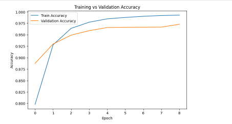
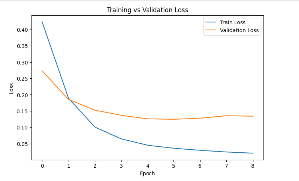
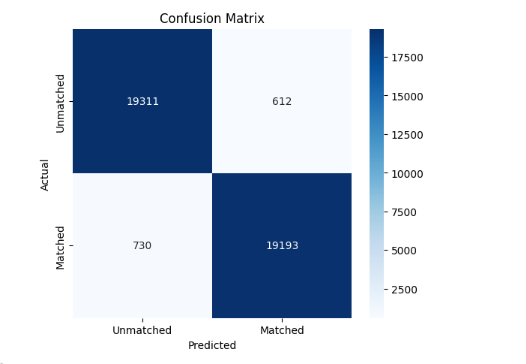
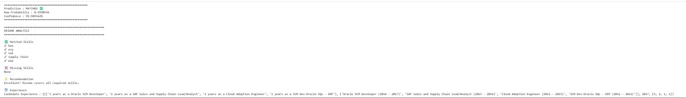

# 📄 Resume–Job Description Matching Agent using Siamese BiLSTM

An AI-powered Resume Screening System that predicts whether a candidate's resume matches a given Job Description using a **Siamese Bidirectional LSTM (BiLSTM)** Neural Network. The project also performs **skill gap analysis** and provides recommendations based on the candidate's resume.

---

## 🚀 Project Overview

Recruiters often spend significant time manually screening resumes against job descriptions. This project automates that process by learning semantic similarities between resumes and job descriptions using a **Siamese BiLSTM architecture**.

The model classifies resume–job pairs as:

- ✅ Matched
- ❌ Unmatched

Additionally, the system highlights:
- Matching Skills
- Missing Skills
- Candidate Experience
- Resume Improvement Recommendations

---

## ✨ Features

- Resume and Job Description preprocessing
- Text cleaning using NLP techniques
- Tokenization and sequence padding
- Siamese BiLSTM Neural Network
- Resume–Job matching prediction
- Skill gap analysis
- Experience display
- Model evaluation using:
  - Accuracy
  - Precision
  - Recall
  - F1 Score
  - Confusion Matrix

---

## 🧠 Model Architecture

```text
Resume --------------------\
                            \
                             Shared Embedding
                                    │
                             Shared BiLSTM Encoder
                                    │
                            Feature Comparison
                                    │
                              Dense Layers
                                    │
                              Sigmoid Output
                                    │
                         Match / Unmatch Prediction
                            /
Job Description -----------/
```

---

## 📊 Results

The model achieved high performance on the validation dataset.

Evaluation includes:

- Training & Validation Accuracy
- Training & Validation Loss
- Confusion Matrix
- Resume Match Prediction

---

## 📁 Repository Structure

```text
Resume-JD-Matching-Agent/
│
├── Resume_JD_Matching_Agent.ipynb
├── README.md
├── requirements.txt
├── .gitignore
└── images/
    ├── accuracy.png
    ├── loss.png
    ├── confusion_matrix.png
    └── prediction.png
```

---

## 📷 Output Screenshots

### Training Accuracy



---

### Training Loss



---

### Confusion Matrix



---

### Resume Prediction



---

## 🛠 Technologies Used

- Python
- TensorFlow / Keras
- NumPy
- Pandas
- Scikit-learn
- NLTK
- Matplotlib
- Seaborn
- Google Colab

---

## ⚙️ Installation

Clone the repository:

```bash
git clone https://github.com/NikitaR04/Resume-JD-Matching-Agent.git
```

Install dependencies:

```bash
pip install -r requirements.txt
```

Open the notebook:

```text
Resume_JD_Matching_Agent.ipynb
```

Run all cells sequentially.

---

## 📂 Dataset

The dataset used for training is **not included** in this repository due to its large size.

---

## 👩‍💻 Author

**Nikita Rani**

B.Tech, Computer Science & Engineering  
KIIT University

Project developed as part of the **IIT-R ML & Agentic AI Summer Internship Training Program**.

---

# 📄 License

This project is intended for educational and academic purposes.
